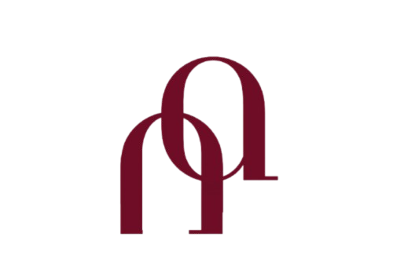

<div align="center">



# Neural Arch — Don Nipuni Athale

### Aspiring Data Scientist & AI Engineer

*Tracing patterns in data, building intelligence for tomorrow.*

[](https://dnkathale-portfolio.netlify.app)
[](https://github.com/nipuni-2002)
[](https://www.linkedin.com/in/nipuni-a-a5445b3b0/)

---

</div>

## ✦ About This Project

**Neural Arch** is my personal portfolio website — a fully custom-built, multi-page static site with a CMS-powered admin panel, dynamic content loading, and a distinctive warm maroon/terracotta/cream design system built entirely from scratch.

This isn't a template. Every component, animation, and interaction was designed and coded specifically for this project, reflecting my personal brand identity — *Neural Arch: Tracing the Arch of Intelligence.*

---

## ✦ Tech Stack

| Layer | Technology |
|-------|-----------|
| **Frontend** | HTML5, CSS3, Vanilla JavaScript |
| **Design System** | Custom CSS tokens, Fraunces + Space Grotesk + JetBrains Mono |
| **Content Management** | Decap CMS (formerly Netlify CMS) |
| **Authentication** | Netlify Identity |
| **Version Control** | Git + GitHub |
| **Hosting** | Netlify (auto-deploy from GitHub) |
| **Contact Form** | Formspree |
| **Animations** | CSS keyframes + IntersectionObserver API |

---

## ✦ Features

### 🎨 Design
- Custom **Neural Arch** brand identity — logo, watermark, and animated SVG signature motif
- Warm palette: Cream `#F7F1E8` · Maroon `#6E0D25` · Terracotta `#C26D5A` · Espresso `#3B241C`
- **Liquid glass** pill buttons with layered shadows, iridescent shimmer, and specular highlights
- Animated hero portrait in a glowing circular frame
- Scroll-triggered reveal animations and cursor glow effect
- Typewriter role animation in the hero section
- Faint Neural Arch watermark in all dark sections

### 📄 Pages
| Page | Description |
|------|-------------|
| **Home** | Hero, about teaser, featured projects, skills, highlights |
| **About** | Full bio, education timeline, achievements, certifications |
| **Projects** | Featured 6 projects with category filter |
| **All Projects** | Full archive (20+ projects) with live filtering |
| **Blog** | Articles grid, all driven by CMS |
| **Blog Post** | Individual post reader with Markdown rendering |
| **Contact** | Contact info + live form wired to Formspree |

### ⚙️ Technical
- **100% dynamic content** — projects, blog posts, and about page all load from JSON data files
- **CMS admin panel** at `/admin` — add, edit, publish content with no code
- **Auto-deploy pipeline** — push to GitHub → Netlify redeploys in seconds
- **Fully responsive** — polished mobile layout with custom breakpoints at 520px and 860px
- **Favicon + Apple touch icon** generated from the Neural Arch logo
- **Git-based CMS** — all content changes are committed to GitHub automatically

---

## ✦ Project Structure

```
portfolio/
├── index.html              # Home
├── about.html              # About
├── projects.html           # Featured projects
├── all-projects.html       # Full archive
├── blog.html               # Blog listing
├── blog-post.html          # Post reader template
├── contact.html            # Contact
├── favicon.ico
├── netlify.toml
├── admin/
│   ├── index.html          # Decap CMS entry point
│   └── config.yml          # CMS field definitions
├── assets/
│   ├── images/             # Logo, watermark, profile photo
│   └── resume/             # CV PDF
├── css/
│   └── style.css           # Full design system
├── js/
│   ├── main.js             # UI interactions & animations
│   └── content.js          # Dynamic JSON content loader
└── data/
    ├── projects.json        # All projects
    ├── blog.json            # All blog posts
    └── about.json           # Bio, timeline, certifications
```

---

## ✦ Design System

```css
/* Color Tokens */
--cream:           #F7F1E8   /* Light sections */
--warm-white:      #FAF7F2   /* Main background */
--maroon:          #6E0D25   /* Primary accent */
--espresso:        #3B241C   /* Dark sections */
--terracotta:      #C26D5A   /* Hover & highlights */
--charcoal:        #2B2B2B   /* Body text */

/* Typography */
--font-display:    'Fraunces'        /* Headings */
--font-body:       'Space Grotesk'   /* Body text */
--font-mono:       'JetBrains Mono'  /* Labels & code */
```

---

## ✦ How to Run Locally

```bash
# Clone the repo
git clone https://github.com/nipuni-2002/portfolio.git
cd portfolio

# Serve locally (no build step needed)
npx serve .

# Open in browser
# http://localhost:3000
```

---

## ✦ How Content Updates Work

```
Write in Admin Panel
        ↓
Decap CMS commits to GitHub
        ↓
Netlify detects push → auto-deploys
        ↓
Live site updates in ~30 seconds
```

No code needed to add projects or publish blog posts. Just log in at `/admin`.

---

## ✦ Focus Areas

`Machine Learning` · `Natural Language Processing` · `Deep Learning`
`Generative AI` · `Predictive Modeling` · `Data Analytics` · `Data Visualization`

---

## ✦ Contact

| | |
|-|-|
| 📧 Email | [dnkathale.work@gmail.com](mailto:dnkathale.work@gmail.com) |
| 💼 LinkedIn | [linkedin.com/in/nipuni-a-a5445b3b0](https://www.linkedin.com/in/nipuni-a-a5445b3b0/) |
| 🐙 GitHub | [github.com/nipuni-2002](https://github.com/nipuni-2002) |
| 🌐 Portfolio | [dnkathale-portfolio.netlify.app](https://dnkathale-portfolio.netlify.app) |

---

<div align="center">

*Neural Arch — Tracing the Arch of Intelligence*

**© 2026 Don Nipuni Athale. All rights reserved.**

</div>
